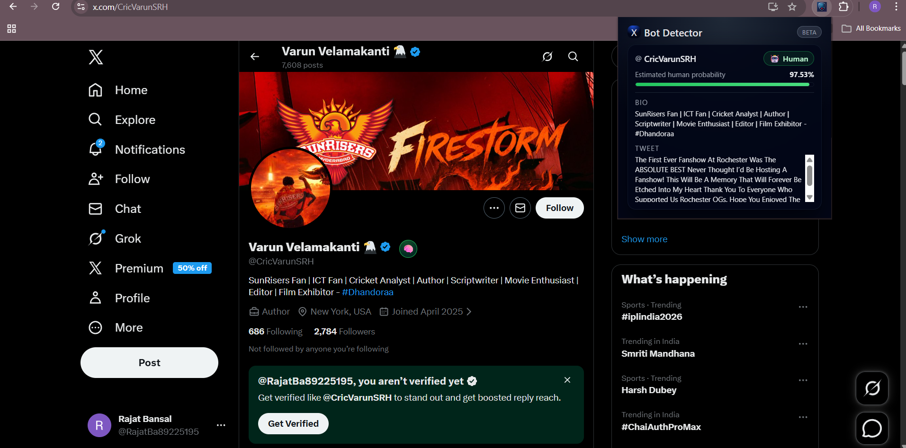

<div align="center">

# 🐦 Twitter Bot Account Classifier

### *Detect bots before they deceive you*

[](https://www.python.org/)
[](https://fastapi.tiangolo.com/)
[](https://xgboost.readthedocs.io/)
[](https://huggingface.co/distilbert-base-uncased)
[](https://developer.chrome.com/docs/extensions/)

<br/>

> A **hybrid machine learning system** that classifies Twitter accounts as **Bot 🤖** or **Human 🧑** using NLP and behavioral features — integrated with a Chrome Extension for real-time analysis.

<br/>

[🚀 Get Started](#-setup--usage) · [🧠 How It Works](#-how-it-works) · [📦 Installation](#-installation) · [🌐 API Reference](#-api-reference)

---

</div>

## ✨ Features

| Feature | Description |
|--------|-------------|
| 🧠 **DistilBERT NLP** | Deep semantic understanding of bios and tweets |
| 📊 **Behavioral Analysis** | Detects patterns in URLs, hashtags, and mentions |
| ⚡ **XGBoost Classifier** | Fast and accurate bot probability prediction |
| 🌐 **FastAPI Backend** | RESTful API with async support |
| 🔌 **Chrome Extension** | Real-time analysis directly on Twitter/X |

---

## 🧠 How It Works

The system uses a **hybrid feature pipeline** that combines deep language understanding with behavioral signals:

```
Twitter Profile → Feature Extraction → Hybrid Vector → XGBoost → Bot Probability
```

### 🔬 Pipeline Breakdown

```
┌─────────────────────────────────────────────────────────────┐
│                    INPUT LAYER                              │
│         Username  ·  Bio  ·  Recent Tweet                   │
└───────────────────────┬─────────────────────────────────────┘
                        │
          ┌─────────────┴──────────────┐
          ▼                            ▼
┌─────────────────┐         ┌──────────────────────┐
│   DistilBERT    │         │  Behavioral Features  │
│   Embeddings    │         │  URLs · Hashtags      │
│   (768-dim)     │         │  Mentions · Patterns  │
└────────┬────────┘         └──────────┬───────────┘
         │                             │
         └──────────┬──────────────────┘
                    ▼
         ┌──────────────────┐
         │  Feature Scaling │
         │  StandardScaler  │
         └────────┬─────────┘
                  ▼
         ┌──────────────────┐
         │  XGBoost Model   │
         └────────┬─────────┘
                  ▼
         🤖 Bot Probability Score
```

---

## 🚀 Setup & Usage

### 📋 Prerequisites

- Python **3.9+**
- pip / virtualenv
- Chrome browser (for the extension)

### 📦 Installation

```bash
# Clone the repository
git clone https://github.com/Rajatb631/Twitter_Bot_Account_Classifier.git
cd Twitter_Bot_Account_Classifier
```

### 🐍 Step 1 — Create Virtual Environment

```bash
python -m venv VENV
```

### ⚡ Step 2 — Activate Virtual Environment

```bash
# Windows
VENV\Scripts\activate

# macOS / Linux
source VENV/bin/activate
```

### ⬆️ Step 3 — Upgrade pip

```bash
python -m pip install --upgrade pip setuptools wheel
```

### 📥 Step 4 — Install Dependencies (with CUDA 11.8 support)

```bash
pip install -r requirements.txt --extra-index-url https://download.pytorch.org/whl/cu118
```

> 💡 This installs **PyTorch with CUDA 11.8** support for GPU-accelerated inference.

### ▶️ Step 5 — Run the FastAPI Backend

```bash
cd backend
uvicorn app:app --host 0.0.0.0 --port 8000
```

Once running, open your browser and visit:

| Interface | URL |
|-----------|-----|
| 🌐 API Base | `http://127.0.0.1:8000` |
| 📖 Interactive Docs (Swagger) | `http://127.0.0.1:8000/docs` |

### 📓 Step 6 — Add Jupyter Kernel (Optional)

To use this environment in Jupyter Notebooks:

```bash
python -m ipykernel install --user --name="my-project-kernel" --display-name="Python (My Project)"
```

Then select **"Python (My Project)"** as the kernel inside your notebook.

### 🔌 Chrome Extension Setup

1. Open Chrome and navigate to `chrome://extensions/`
2. Enable **Developer Mode** (top right toggle)
3. Click **Load Unpacked** and select the `extension/` folder
4. Visit any Twitter/X profile — the extension will analyze it in real-time! ✅

---

## 🌐 API Reference

### `POST /predict`

Predict whether a Twitter account is a bot.

**Request Body:**
```json
{
  "username": "example_user",
  "bio": "I love tweeting about everything!",
  "tweet": "Check out this amazing deal! #sale #free http://spamlink.com"
}
```

**Response:**
```json
{
  "username": "example_user",
  "bot_probability": 0.87,
  "prediction": "Bot 🤖",
  "confidence": "High"
}
```

---

## 🗂️ Project Structure

```
Twitter_Bot_Account_Classifier/
│
├── 📁 extension/              # Chrome Extension files
│   ├── manifest.json
│   ├── popup.html
│   └── content.js
│
├── 📁 model/                  # Trained ML models
│   ├── xgboost_model.pkl
│   └── scaler.pkl
│
├── 📄 main.py                 # FastAPI application
├── 📄 predictor.py            # Prediction pipeline
├── 📄 feature_extractor.py    # NLP + behavioral features
├── 📄 requirements.txt
└── 📄 README.md
```

---

## 📸 Screenshots

<div align="center">
  
  <p><em>🔍 Chrome Extension analyzing <strong>@CricVarunSRH</strong> — classified as <strong>Human 🧑</strong> with 97.53% probability</em></p>
</div>

---

## 🛠️ Tech Stack

<div align="center">

| Layer | Technology |
|-------|-----------|
| **Language** | Python 3.9 |
| **ML Model** | XGBoost |
| **NLP** | DistilBERT (HuggingFace Transformers) |
| **Backend** | FastAPI + Uvicorn |
| **Feature Scaling** | Scikit-learn StandardScaler |
| **Frontend** | Chrome Extension (HTML/JS) |

</div>

---

## 🤝 Contributing

Contributions are welcome! Here's how to get started:

1. **Fork** the repository
2. **Create** your feature branch: `git checkout -b feature/amazing-feature`
3. **Commit** your changes: `git commit -m 'Add amazing feature'`
4. **Push** to the branch: `git push origin feature/amazing-feature`
5. **Open** a Pull Request

---

## 📄 License

This project is licensed under the **MIT License** — see the [LICENSE](LICENSE) file for details.

---

<div align="center">

Made with ❤️ by [Rajat Bansal](https://github.com/Rajatb631)

⭐ Star this repo if you found it useful!

</div>